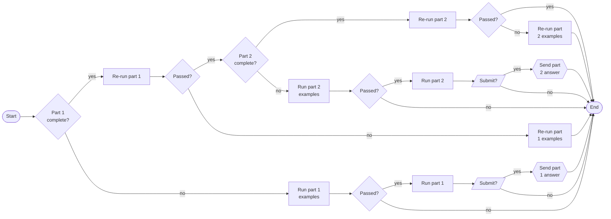

# Advent of Code Copilot

AoC Copilot (AoCC) helps you iterate through cycles of code...test faster by automatically extracting the examples from [Advent of Code](https://adventofcode.com/) puzzles and running your solutions against them.  Then, when all examples pass, it runs your solution against your unique input and submits the answer after getting your confirmation.

## Table of Contents
- [Years Supported](#years-supported)
- [Installation](#installation)
- [Preparation](#preparation)
    - [AoC Session Cookie](#aoc-session-cookie)
    - [Corporate Networks and Self-Signed Certificates (Optional)](#corporate-networks-and-self-signed-certificates)
- [Getting Started](#getting-started)
    - [TypeScript](#typescript)
    - [Solver](#solver)
    - [Runner](#runner)
- [Process Flow](#process-flow)
- [Commands](#commands)
- [Features](#features)
- [Contributing](#contributing)
- [Acknowledgements](#acknowledgements)
- [License](#license)

<a id="years-supported"></a>
## Years Supported

Currently, years 2020 - 2023 are fully supported.

AoCC will likely also work for several puzzles in years 2019 and earlier using its default search strategy, but it will almost certainly fail to find some examples.  When that happens, you can still use it by telling it where to find the examples by supplying the [addDb](#addDb) parameter to the runner.

Please consider saving your `addDb` values in the [example database](egdb/README.md) to [contribute](#contributing) to this project!

<a id="installation"></a>
## Installation
```shell
npm install aoc-cockpit
```

<a id="preparation"></a>
## Preparation

<a id="aoc-session-cookie"></a>
### AoC Session Cookie

AoCC will connect to the [Advent of Code](https://adventofcode.com/) website to retrieve puzzles and inputs on your behalf.
In order for this to work, you need to retrieve your session ID from the adventofcode.com cookie and store it in a `.env` file in the root of your project.

Steps for Chromium-based browsers like Chrome and Edge:
1. Browse to [Advent of Code](https://adventofcode.com/) and log in
2. Open Developer Tools (F12)
3. Click the "Application" tab
4. In the "Storage" section expand "Cookies"
5. Click on https<nolink>://adventofcode.com
6. Copy the value from the session row
7. Open or create a `.env` file in the root of your project
8. Add a line `AOC_SESSION_COOKIE="session="` and paste your session value after the equals sign

For example:
```
AOC_SESSION_COOKIE="session=**your_session_value**"
```

<a id="corporate-networks-and-self-signed-certificates"></a>
### Corporate Networks and Self-Signed Certificates (Optional)

If you are on a network that has a self-signed certificate then you will receive a `SELF_SIGNED_CERT_IN_CHAIN` error when attempting to connect to the AoC website.

Steps to [override](https://nodejs.org/api/tls.html#tlscreatesecurecontextoptions) the normal certificate authorities with your own certificate bundle:
1. Browse to [Advent of Code](https://adventofcode.com/) and log in
2. Open Developer Tools (F12)
3. Click on the Security tab (if you don't see it, click the "+" sign and add it)
4. Click "View certificate"
5. Click on the Details tab
6. Select the root certificate (the one at the top of the hierarchy) and click Export and save it somewhere locally
7. Repeat for the intermediate certificate (the second one in the hierarchy)
8. Repeat for the primary certificate (the third one in the hierarchy)
9. Open or create a `.env` file in the root of your project
10. Add a line `CERTIFICATE=""` and paste the contents of the certificates inside the double quotes in **reverse** hierarchy order (primary, intermediate, root)

For example:
```
AOC_SESSION_COOKIE="session=**your_session_value**"
CERTIFICATE="-----BEGIN CERTIFICATE-----
**your_primary_certificate**
-----END CERTIFICATE-----
-----BEGIN CERTIFICATE-----
**your_intermediate_certificate**
-----END CERTIFICATE-----
-----BEGIN CERTIFICATE-----
**your_root_certificate**
-----END CERTIFICATE-----"
```

<a id="getting-started"></a>
## Getting Started

<a id="typescript"></a>
### TypeScript

Create a new file named `aocYYDD.ts` where YY is the two-digit year and DD is the two-digit day of the puzzle you are solving and paste the following code:
```TypeScript
import { run } from 'aoc-copilot';

async function solve(inputs: string[], part: number, test: boolean, additionalInfo?: { [key:string]: string }): Promise<number | string> {
    let answer: number | string = 0;
    throw new Error('Not implemented'); // <-- Replace with your solution (raising an exception forces printing the example input and answer to the console)
    return answer;
}

run(__filename, solve);
```

Run it, and it will download the puzzle and inputs from the adventofcode.com site and cache them on your local computer, then it will display the example inputs and expected answer in the console.  Replace the `throw new Error` line of code with your solution and place the calculated answer in the `answer` variable.  Run it again and AoCC will intelligently run your solution against the part 1 example(s) first, and if they pass it will run your solver against the actual inputs then prompt you if you'd like to submit your answer.  See the full [process flow](#process-flow) below.

<a id="solver"></a>
### Solver

The `solve` function, or "solver", is where you write code to solve the puzzle.  Parameters:

- `inputs` (string[]): Contents of the example or actual inputs
- `part` (integer): Indicates whether the solver is being called for part 1 or part 2 of the puzzle
- `test` (boolean): Indicates whether the solver is being run for an example or actual input
<a id="solver-additional-info"></a>
- `additionalInfo` (object) (optional): In most cases `part` and `test` can be used to determine additional values needed in calculating the solution.  However when there are multiple test cases sometimes additional information is needed.  In those cases `additionalInfo` will have a property with the necessary value.  For example, in part 1 of [day 21, 2023](https://adventofcode.com/2023/day/21) the example is based on the elf taking 6 steps, while the actual input needs to be calculated for the elf taking 64 steps.  So far, so good.  Then, in part 2 **spoiler alert** the actual input needs to be calculated using over 20,000,000 steps!  That's a lot, but if that were the last difference then the combination of `part` and `test` would still be sufficient to determine how many steps to calculate for.  But, there are 7 additional examples given for part 2, each one for a different number of steps.  In this case, `additionalInfo` will have property `numberOfSteps` to tell you how many steps to use in your calculation.
- Returns (promise<number | string>): Most puzzles have a numeric answer, but a few answers are strings. 

`solve` is async so you can use `await` in your code, for example with the `readline` package for getting input from the console.  This is useful in scenarios like **spoiler alert** part 2 of [day 13, 2021](https://adventofcode.com/2021/day/13) where you need to read (with your eyes) the results of folding the paper then type that code in as the answer.

<a id="runner"></a>
### Runner

The `run` function, or "runner", takes your solver and automates running it.  Parameters:

- `yearDay` (string | { year: number, day: number }): Name your file xxxYYDD.xx (e.g. aoc2301.ts) where YY is the 2-digit year and DD is the day being solved, then pass __filename to this parameter.  Optionally, pass an object where you specify the year and day explicitly.
- `solver` (function): your `solve` function.
- `testsOnly` (boolean) (optional): Set to `true` to force the runner to only run the examples, or set to `false` (default) to allow the runner to follow it's [normal flow](#process-flow).
<a id="addDb"></a>
- `addDb` (object) (optional): If AoCC doesn't find the examples on its own you can use this parameter to tell it how to find them, or use it to override the ones it found.  See the example database [documentation](egdb/README.md) for details on the structure.  Consider contributing your database entry for days that don't yet have them!
- `addTc` (array) (optional): Use this to supply additional test cases.  Parameters:
    - `part` (number): Indicates whether the test case is for part 1 or part 2
    - `inputs` (string[]): Test case inputs
    - `answer` (string): Expected answer
    - `additionalInfo` (object) (optional): Additional info to be supplied with the test case; see the `additionalInfo` parameter [documentation](#solver-additional-info) on the solver above.

The simplest and most common way to call the runner looks like this:

```TypeScript
run(__filename, solve);
```

On the other extreme, a complex example would look like (**spoiler alert**):

```TypeScript
// Additional test cases from https://www.reddit.com/r/adventofcode/comments/18o1071/2023_day_21_a_better_example_input_mild_part_2/
const testInputs = [
    ".................",
    "..#..............",
    "...##........###.",
    ".............##..",
    "..#....#.#.......",
    ".......#.........",
    "......##.##......",
    "...##.#.....#....",
    "........S........",
    "....#....###.#...",
    "......#..#.#.....",
    ".....#.#..#......",
    ".#...............",
    ".#.....#.#....#..",
    "...#.........#.#.",
    "...........#..#..",
    "................."
];

run(__filename, solve, false,
    {
        "reason": "Multiple examples",
        "part1length": 1,
        "inputs": {
            "selector": "code",
            "indexes": [4, 4, 4, 4, 4, 4, 4, 4]
        },
        "answers": {
            "selector": "code",
            "indexesOrLiterals": [16, 27, 29, 31, 33, 35, 37, 39]
        },
        "additionalInfos": {
            "key": "numberOfSteps",
            "selector": "code",
            "indexes": [15, 26, 28, 30, 32, 34, 36, 38]
        }
    },
    [
        { part: 2, inputs: testInputs, answer: "52", additionalInfo: { "numberOfSteps": "7" } },
        { part: 2, inputs: testInputs, answer: "68", additionalInfo: { "numberOfSteps": "8" } },
        { part: 2, inputs: testInputs, answer: "576", additionalInfo: { "numberOfSteps": "25" } },
        { part: 2, inputs: testInputs, answer: "1576", additionalInfo: { "numberOfSteps": "42" } },
        { part: 2, inputs: testInputs, answer: "3068", additionalInfo: { "numberOfSteps": "59" } },
        { part: 2, inputs: testInputs, answer: "5052", additionalInfo: { "numberOfSteps": "76" } },
        { part: 2, inputs: testInputs, answer: "1185525742508", additionalInfo: { "numberOfSteps": "1180148" } },
    ]
);
```
<a id="process-flow"></a>
## Process Flow

The runner evaluates your current progress to determine what steps to run next.  Here's the whole flow:



<a id="commands"></a>
## Commands
AoCC supports a few different commands that can be useful during development and for troubleshooting.  See the [documentation](docs/commands.md).

<a id="features"></a>
## Features

- Automatically retrieves example inputs and answers
- Runs your solution against the examples and compares the answers
- Runs your solution against the puzzle input if all examples pass
- Submits the answer and reports back whether it was correct or not
- Compares answer to previously know too high/too low answers and rejects them if they're still too high/too low
- Regression tests your solution against the input if an answer was previously accepted
- For both parts 1 and 2

<a id="contributing"></a>
## Contributing

Contributions to the [example database](egdb/README.md) are needed for years 2020 and earlier.

<a id="acknowledgements"></a>
## Acknowledgements

Thank you to [Eric Wastl](http://was.tl/), the creator of [Advent of Code](https://adventofcode.com)!

AoCC attempts to honor Eric's wishes in the following ways:

- Caches puzzles and inputs in order to [be gentle](https://www.reddit.com/r/adventofcode/comments/3v64sb/aoc_is_fragile_please_be_gentle/), storing them in the user's home directory so that [puzzles and inputs won't be stored in a public repository](https://adventofcode.com/2023/about#faq_copying).
- Remembers previous incorrect answers so it doesn't submit duplicates, and waits the required amount of time to submit new answers after submitting a wrong answer (1, 5, 10 or 15 minutes after 1, 3, 7 or 11 incorrect guesses in a row, respectively).
- Identifies itself with the [User-Agent header](https://www.reddit.com/r/adventofcode/comments/z9dhtd/please_include_your_contact_info_in_the_useragent/) so that the AoC site has a way to identify traffic generated by this project.

<a id="license"></a>
## License
[MIT](LICENSE)