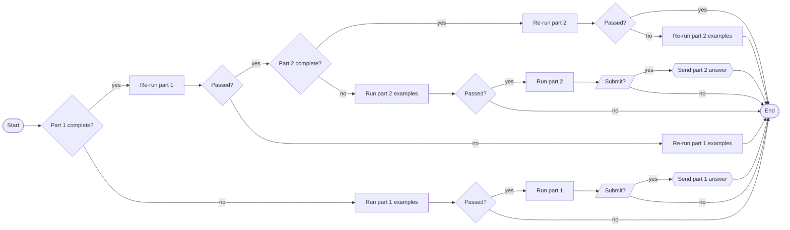

# Runner

As shown in [getting started](../README.md#typescript), the simplest way to call the `run` function ("runner") is like this:

```TypeScript
run(__filename, solve);
```

## Mandatory Parameters

At a minimum, two parameters are needed to start the runner:
- `yearDay` (string | { year: number, day: number }):
    - Recommendation: name your file aocYYDD.ts where YY is the 2-digit year and DD is the day being solved then simply pass `__filename` to this parameter
    - Optional: pass an object with year and day attributes.
- `solver` (function): reference to your `solve` [function](../README.md#solver).

## Optional Parameters

- `options` ({ testsOnly?: boolean, skipTests?: boolean, onlyPart?: 1 | 2, forceSubmit?: boolean }) (optional): If ommitted, the runner will use its default options documented in the [process flow](#process-flow) below.  The following attributes can be used to fine-tune the behavior:
    - `forceSubmit` (boolean): `true` = submit the answer without confirmation; `false` (default) = you must confirm before the answer will be submitted
    - `onlyPart` (number): `1` = run only part 1; `2` = run only part 2; (ommitted) (default) = both parts will be run
    - `skipTests` (boolean): `true` = examples will be skipped; `false` (default) = examples will not be skipped
    - `testsOnly` (boolean): `true` = only examples will be run; `false` (default) = both examples and actual inputs will be run.<br>**NOTE**: For compatibility, `options` also accepts a boolean which functions the same as the `testsOnly` attribute.
<a id="addDb"></a>
- `addDb` (object) (optional): Provide the runner with information about where to locate the example(s) and expected answer(s) in a puzzle file.  Useful when AoCC is unable to extract examples automatically.  See the [example database documentation](../docs/egdb.md) for details.
- `addTc` (object[]) (optional): Additional [test cases](./test-cases.md).

### Command Line Arguments

If you'd prefer to pass the optional parameters as command line arguments then import the `argsToOptions` function and call the runner like this:

```TypeScript
import { argsToOptions, NotImplemented, run } from 'aoc-copilot';
...
const options = argsToOptions(process.argv);
run(__filename, solve, options);
```

The command line arguments `--force-submit`, `--only-part`, `--skip-tests` and `--tests-only` correspond to the options above.

<a id="process-flow"></a>
## Process Flow

By default, the runner evaluates your current progress to determine what steps to run next:

